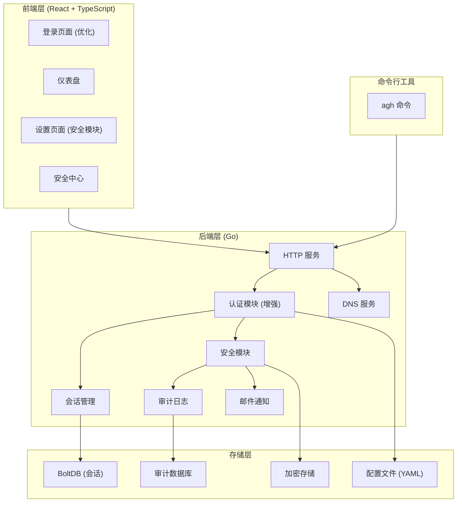

# AdGuardHome 私人定制安全版 - 技术设计文档

Feature Name: adguard-private-security
Updated: 2026-02-18

## 描述

本文档描述 AdGuardHome 私人定制安全版的技术架构、组件设计和实现方案。基于官方 AdGuardHome 进行二次开发，实现安全加固、邮件告警、命令行工具、UI优化等功能。

## 架构概览



## 组件与接口设计

### 1. 认证模块增强 (internal/home/auth_enhanced.go)

```go
type EnhancedAuthConfig struct {
    TOTP            *TOTPConfig
    PasswordPolicy  *PasswordPolicy
    LoginLimiter    *LoginLimiter
    DeviceTracker   *DeviceTracker
}

type TOTPConfig struct {
    Enabled    bool
    Secret     []byte
    Issuer     string
    Period     uint
    Digits     uint
}

type PasswordPolicy struct {
    MinLength      int
    RequireUpper   bool
    RequireLower   bool
    RequireDigit   bool
    RequireSpecial bool
    SpecialChars   string
}

type LoginLimiter struct {
    MaxAttempts    int
    LockoutPeriod  time.Duration
    AttemptsByIP   map[string]int
    LockoutByIP    map[string]time.Time
}
```

### 2. TOTP 实现 (internal/home/totp.go)

```go
type TOTPService struct {
    secret     []byte
    issuer     string
    period     uint
    digits     uint
    algorithm  otp.Algorithm
}

func (t *TOTPService) GenerateSecret(login string) (secret string, qrCode []byte, err error)
func (t *TOTPService) Validate(code string) (valid bool, err error)
func (t *TOTPService) GenerateQRCode(secret, login string) ([]byte, error)
```

### 3. 设备指纹与跟踪 (internal/home/device.go)

```go
type DeviceFingerprint struct {
    ID         string
    UserAgent  string
    IP         string
    LastSeen   time.Time
    FirstSeen  time.Time
    IsTrusted  bool
    Location   *GeoLocation
}

type DeviceTracker struct {
    knownDevices map[string]*DeviceFingerprint
    maxDevices   int
}

func (dt *DeviceTracker) GenerateFingerprint(r *http.Request) string
func (dt *DeviceTracker) IsNewDevice(fingerprint string) bool
func (dt *DeviceTracker) CheckGeoAnomaly(currentIP string) (anomaly bool, location *GeoLocation)
```

### 4. 审计日志模块 (internal/auditlog/auditlog.go)

```go
type AuditEvent struct {
    ID           string
    Timestamp    time.Time
    EventType    EventType
    Severity     Severity
    UserID       string
    IPAddress    string
    UserAgent    string
    DeviceID     string
    Action       string
    Resource     string
    Details      map[string]interface{}
    RiskScore    int
}

type AuditLogger struct {
    db     *bbolt.DB
    config *AuditConfig
}

func (al *AuditLogger) Log(event *AuditEvent) error
func (al *AuditLogger) Query(filter *AuditFilter) ([]*AuditEvent, error)
func (al *AuditLogger) Rotate(maxAge time.Duration) error
```

### 5. 邮件通知模块 (internal/notify/smtp.go)

```go
type SMTPConfig struct {
    Host        string
    Port        int
    UseTLS      bool
    Username    string
    Password    string
    From        string
    To          string
}

type NotifyService struct {
    config     *SMTPConfig
    templates  map[EventType]*template.Template
}

func (n *NotifyService) Send(event *AuditEvent) error
func (n *NotifyService) TestConnection() error
func (n *NotifyService) IsEnabled() bool
```

### 6. 安全中间件 (internal/home/security_middleware.go)

```go
type SecurityMiddleware struct {
    customPath      string
    rateLimiter     *RateLimiter
    scannerDetector *ScannerDetector
    securityHeaders map[string]string
}

func (sm *SecurityMiddleware) Wrap(h http.Handler) http.Handler
func (sm *SecurityMiddleware) checkCustomPath(r *http.Request) bool
func (sm *SecurityMiddleware) addSecurityHeaders(w http.ResponseWriter)
func (sm *SecurityMiddleware) detectScanner(r *http.Request) bool
```

### 7. 加密存储 (internal/crypto/encrypted_store.go)

```go
type EncryptedStore struct {
    keyFile  string
    key      []byte
}

func (es *EncryptedStore) Encrypt(data []byte) ([]byte, error)
func (es *EncryptedStore) Decrypt(data []byte) ([]byte, error)
func (es *EncryptedStore) Store(path string, data []byte) error
func (es *EncryptedStore) Load(path string) ([]byte, error)
```

### 8. agh 命令行工具 (cmd/agh/main.go)

```go
func main() {
    if len(os.Args) < 2 {
        printHelp()
        os.Exit(1)
    }

    command := os.Args[1]
    args := os.Args[2:]

    switch command {
    case "status":
        cmdStatus()
    case "reset-password":
        cmdResetPassword(args)
    case "disable-2fa":
        cmdDisable2FA()
    case "reset-2fa":
        cmdReset2FA()
    case "sessions":
        cmdSessions()
    case "logout":
        cmdLogout(args)
    case "logs":
        cmdLogs(args)
    case "whitelist":
        cmdWhitelist(args)
    case "security-check":
        cmdSecurityCheck()
    case "security-wizard":
        cmdSecurityWizard()
    case "notify":
        cmdNotify(args)
    case "help":
        printHelp()
    default:
        fmt.Printf("未知命令: %s\n", command)
        printHelp()
        os.Exit(1)
    }
}
```

## 数据模型

### 配置文件扩展 (AdGuardHome.yaml)

```yaml
users:
  - name: admin
    password: $bcrypt_hash$

security:
  single_user_mode: true
  password_policy:
    min_length: 12
    require_upper: true
    require_lower: true
    require_digit: true
    require_special: true
  totp:
    enabled: true
    secret: $encrypted$
  session:
    single_device: true
    timeout: 30m
  login:
    max_attempts: 5
    lockout_period: 30m
  custom_path: "xK9mN2pL7qR4"
  allowed_dns_clients:
    - 192.168.1.0/24
    - 10.0.0.1

audit:
  enabled: true
  retention_days: 90
  log_file: data/audit.log

notify:
  smtp:
    host: smtp.example.com
    port: 587
    tls: true
    username: user@example.com
    password: $encrypted$
    from: noreply@example.com
    to: admin@example.com
  events:
    - login_success
    - login_failure
    - login_lockout
    - new_device
    - geo_anomaly
    - config_change
```

### 审计日志数据结构 (BoltDB)

```go
bucket: "audit_events"
key: timestamp_unixnano
value: {
    "id": "uuid",
    "timestamp": "2026-02-18T10:30:00Z",
    "type": "LOGIN_SUCCESS",
    "severity": "INFO",
    "user_id": "admin",
    "ip": "192.168.1.100",
    "user_agent": "Mozilla/5.0...",
    "device_id": "fp_xxx",
    "action": "login",
    "details": {},
    "risk_score": 0
}
```

## HTTP API 设计

### 新增 API 端点

| 方法 | 路径 | 描述 |
|------|------|------|
| POST | /control/security/totp/enable | 启用 TOTP |
| POST | /control/security/totp/disable | 禁用 TOTP |
| GET | /control/security/totp/qrcode | 获取 TOTP 二维码 |
| POST | /control/security/totp/verify | 验证 TOTP 码 |
| GET | /control/security/status | 获取安全状态 |
| GET | /control/security/score | 获取安全评分 |
| GET | /control/audit/logs | 查询审计日志 |
| GET | /control/audit/events | 获取事件类型列表 |
| POST | /control/notify/config | 配置邮件通知 |
| POST | /control/notify/test | 测试邮件通知 |
| GET | /control/sessions | 获取活跃会话 |
| DELETE | /control/sessions/{id} | 注销指定会话 |
| POST | /control/whitelist | 添加 DNS 白名单 |
| DELETE | /control/whitelist | 删除 DNS 白名单 |
| GET | /control/whitelist | 获取 DNS 白名单 |

## 前端组件设计

### 目录结构

```
client/src/
├── components/
│   ├── Security/
│   │   ├── SecurityCenter.tsx      # 安全中心主页
│   │   ├── TOTPSetup.tsx           # TOTP 设置向导
│   │   ├── TOTPVerify.tsx          # TOTP 验证输入
│   │   ├── SecurityScore.tsx       # 安全评分组件
│   │   ├── AuditLog.tsx            # 审计日志查看
│   │   ├── NotifySettings.tsx      # 通知设置
│   │   └── DeviceList.tsx          # 已知设备列表
│   ├── Login/
│   │   ├── Form.tsx                # 登录表单（增强）
│   │   └── Login.css               # 样式（移动端优化）
│   └── ui/
│       ├── MobileNav.tsx           # 移动端导航
│       └── ResponsiveTable.tsx     # 响应式表格
├── actions/
│   └── security.ts                 # 安全相关 actions
├── reducers/
│   └── security.ts                 # 安全相关 reducers
└── __locales/
    └── zh-cn.json                  # 仅保留简体中文
```

### 移动端 UI 优化策略

1. **响应式布局**
   - 使用 CSS Grid 和 Flexbox
   - 断点: 320px, 480px, 768px, 1024px

2. **触摸友好**
   - 最小点击区域 44x44px
   - 增加按钮间距
   - 支持滑动手势

3. **简化视图**
   - 仪表盘使用卡片布局替代表格
   - 隐藏次要信息，点击展开
   - 底部固定操作栏

## 安装脚本设计

### install.sh

```bash
#!/bin/bash

# AdGuardHome 私人定制安全版安装脚本

set -e

VERSION="1.0.0"
INSTALL_DIR="/opt/adguard-home"
DATA_DIR="/var/lib/adguard-home"
CONFIG_FILE="$DATA_DIR/AdGuardHome.yaml"

# 检测系统架构
detect_arch() {
    case $(uname -m) in
        x86_64)  echo "amd64" ;;
        aarch64) echo "arm64" ;;
        *)       echo "Unsupported architecture"; exit 1 ;;
    esac
}

# 下载二进制文件
download_binary() {
    local arch=$(detect_arch)
    local url="https://github.com/xiaoxinqian/AdGuardHome/releases/download/v${VERSION}/AdGuardHome_linux_${arch}.tar.gz"
    curl -fsSL "$url" | tar xz -C /tmp
}

# 生成随机管理路径
generate_custom_path() {
    openssl rand -hex 8
}

# 初始化配置
init_config() {
    local custom_path=$(generate_custom_path)
    
    cat > "$CONFIG_FILE" << EOF
http:
  address: 0.0.0.0:80
  session_ttl: 30m

security:
  single_user_mode: true
  custom_path: "$custom_path"
  password_policy:
    min_length: 12
    require_upper: true
    require_lower: true
    require_digit: true
    require_special: true

audit:
  enabled: true
  retention_days: 90
EOF

    echo "$custom_path"
}

# 设置管理员密码
set_admin_password() {
    local password
    while true; do
        read -s -p "请输入管理员密码 (至少12位，包含大小写字母、数字和特殊字符): " password
        echo
        if validate_password "$password"; then
            break
        fi
        echo "密码不符合策略要求，请重新输入"
    done
    
    "$INSTALL_DIR/AdGuardHome" --set-password "$password"
}

# 创建 systemd 服务
create_service() {
    cat > /etc/systemd/system/adguard-home.service << EOF
[Unit]
Description=AdGuard Home Private Security Edition
After=network.target

[Service]
Type=simple
ExecStart=$INSTALL_DIR/AdGuardHome -c $CONFIG_FILE -w $DATA_DIR
Restart=on-failure
RestartSec=5s

[Install]
WantedBy=multi-user.target
EOF

    systemctl daemon-reload
    systemctl enable adguard-home
    systemctl start adguard-home
}

# 主安装流程
main() {
    echo "开始安装 AdGuardHome 私人定制安全版..."
    
    download_binary
    mv /tmp/AdGuardHome "$INSTALL_DIR"
    
    mkdir -p "$DATA_DIR"
    local custom_path=$(init_config)
    
    set_admin_password
    create_service
    
    echo "安装完成!"
    echo "管理后台地址: http://your-server/$custom_path/"
    echo "请妥善保管此地址"
}

main "$@"
```

## 正确性属性

### 安全不变量

1. **认证不变量**: 所有管理操作必须经过有效的认证会话
2. **加密不变量**: 敏感数据必须加密存储，明文数据不得持久化
3. **审计不变量**: 所有安全相关事件必须记录到审计日志
4. **单用户不变量**: 用户表中始终只有一个管理员账户

### 约束条件

1. TOTP 密钥长度必须为 20 字节（Base32 编码后 32 字符）
2. 会话令牌长度必须为 16 字节
3. 加密密钥必须为 32 字节（AES-256）
4. 管理路径长度必须为 16 字符

## 错误处理

### 错误类型

```go
const (
    ErrInvalidPassword    = errors.Error("密码不符合策略要求")
    ErrTOTPRequired       = errors.Error("需要 TOTP 验证")
    ErrTOTPInvalid        = errors.Error("TOTP 验证码无效")
    ErrAccountLocked      = errors.Error("账户已被锁定")
    ErrSessionExpired     = errors.Error("会话已过期")
    ErrDeviceNotTrusted   = errors.Error("设备未受信任")
    ErrGeoAnomaly         = errors.Error("检测到异地登录")
    ErrPathNotFound       = errors.Error("页面不存在")
)
```

### HTTP 错误响应

| 状态码 | 场景 |
|--------|------|
| 400 | 请求参数无效 |
| 401 | 未认证或认证失效 |
| 403 | 权限不足 |
| 404 | 资源不存在（含隐藏管理路径） |
| 429 | 请求频率超限 |
| 500 | 服务器内部错误 |

## 测试策略

### 单元测试

1. **认证模块测试**
   - 密码策略验证
   - TOTP 生成与验证
   - 会话创建与销毁

2. **加密模块测试**
   - 加密解密往返测试
   - 密钥管理测试

3. **审计模块测试**
   - 日志记录测试
   - 查询过滤测试

### 集成测试

1. **登录流程测试**
   - 正常登录流程
   - 密码错误流程
   - TOTP 验证流程
   - 锁定流程

2. **API 测试**
   - 所有新增 API 端点
   - 错误响应格式

### 端到端测试

1. **安装流程测试**
   - 一键安装脚本
   - 配置初始化
   - 服务启动

2. **移动端 UI 测试**
   - 响应式布局
   - 触摸操作

## 实现计划

### Phase 1: 核心安全功能 (P0)

| 任务 | 预估时间 |
|------|----------|
| TOTP 二步验证 | 2 天 |
| 密码策略增强 | 1 天 |
| 审计日志模块 | 2 天 |
| 单用户模式 | 0.5 天 |
| 登录失败锁定 | 1 天 |
| 加密存储 | 1 天 |
| 安全响应头 | 0.5 天 |

### Phase 2: 高级安全功能 (P1)

| 任务 | 预估时间 |
|------|----------|
| 自定义管理路径 | 1 天 |
| 设备指纹与跟踪 | 2 天 |
| 异地登录检测 | 1 天 |
| DNS 访问控制 | 1 天 |
| 邮件通知模块 | 2 天 |

### Phase 3: CLI 与 UI (P1)

| 任务 | 预估时间 |
|------|----------|
| agh 命令行工具 | 2 天 |
| 移动端 UI 优化 | 3 天 |
| 安全中心界面 | 2 天 |

### Phase 4: 安装与部署 (P0)

| 任务 | 预估时间 |
|------|----------|
| 安装脚本 | 1 天 |
| 语言文件清理 | 0.5 天 |
| 构建配置 | 0.5 天 |

### Phase 5: 收尾 (P2)

| 任务 | 预估时间 |
|------|----------|
| 安全评分功能 | 1 天 |
| 异常流量拦截 | 1 天 |
| 文档完善 | 1 天 |

## 文件变更清单

### 新增文件

```
internal/
├── auditlog/
│   ├── auditlog.go
│   └── auditlog_test.go
├── crypto/
│   ├── encrypted_store.go
│   └── encrypted_store_test.go
├── notify/
│   ├── smtp.go
│   └── smtp_test.go
└── home/
    ├── totp.go
    ├── totp_test.go
    ├── device.go
    ├── device_test.go
    ├── security_middleware.go
    ├── security_middleware_test.go
    ├── auth_enhanced.go
    ├── audit.go
    └── security_api.go

cmd/
└── agh/
    └── main.go

scripts/
└── install.sh

client/src/
├── components/Security/
│   ├── SecurityCenter.tsx
│   ├── TOTPSetup.tsx
│   ├── TOTPVerify.tsx
│   ├── SecurityScore.tsx
│   ├── AuditLog.tsx
│   ├── NotifySettings.tsx
│   └── DeviceList.tsx
└── actions/security.ts
```

### 修改文件

```
internal/home/
├── auth.go              # 添加 TOTP 验证
├── authhttp.go          # 增强认证流程
├── config.go            # 添加安全配置字段
├── web.go               # 注册新 API
└── home.go              # 初始化安全模块

client/src/
├── login/Login/index.tsx   # 添加 TOTP 输入
├── login/Login/Login.css   # 移动端样式
├── i18n.ts                 # 移除多语言支持
└── initialState.ts         # 添加安全状态
```

### 删除文件

```
client/src/__locales/
├── ar.json
├── be.json
├── bg.json
├── cs.json
├── da.json
├── de.json
├── en.json
├── es.json
├── ... (所有非 zh-cn.json)
├── zh-hk.json
└── zh-tw.json
```

## 依赖项

### 新增 Go 依赖

```go
require (
    github.com/pquerna/otp v1.4.0    // TOTP 支持
    github.com/go-gomail/gomail v2.0.0+incompatible  // SMTP 邮件
)
```

## 参考

[^1]: (File) - internal/home/auth.go - 现有认证实现
[^2]: (File) - internal/aghuser/session.go - 会话数据结构
[^3]: (File) - client/src/login/Login/index.tsx - 现有登录组件
