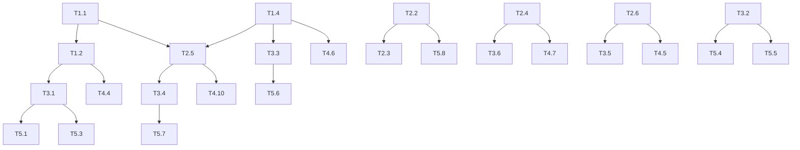

# AdGuardHome 私人定制安全版 - 实施任务列表

## 概述

基于需求规格文档和技术设计文档，本文档将开发工作分解为可执行的任务单元。

## 任务分组

### Group 1: 后端安全核心 (P0)

#### T1.1 创建加密存储模块
- **文件**: `internal/crypto/encrypted_store.go`, `internal/crypto/encrypted_store_test.go`
- **描述**: 实现 AES-256-GCM 加密存储，用于保护敏感配置
- **验收标准**: 
  - 加密解密功能正常
  - 单元测试覆盖率 > 80%
- **预估**: 4小时

#### T1.2 实现 TOTP 服务
- **文件**: `internal/home/totp.go`, `internal/home/totp_test.go`
- **描述**: 实现基于时间的一次性密码生成和验证
- **依赖**: T1.1 (用于存储 TOTP 密钥)
- **验收标准**:
  - 生成符合 RFC 6238 的 TOTP
  - 支持二维码生成
  - 验证容错窗口 ±1 周期
- **预估**: 6小时

#### T1.3 增强密码策略
- **文件**: `internal/home/auth.go`, `internal/home/auth_enhanced.go`
- **描述**: 实现强密码验证逻辑
- **验收标准**:
  - 验证密码长度 >= 12
  - 验证包含大小写字母、数字、特殊字符
  - 设置密码时强制验证
- **预估**: 3小时

#### T1.4 实现审计日志模块
- **文件**: `internal/auditlog/auditlog.go`, `internal/auditlog/auditlog_test.go`
- **描述**: 实现安全事件的记录和查询
- **验收标准**:
  - 记录登录、操作、异常事件
  - 支持 IP、时间范围、事件类型过滤
  - 支持自动清理过期日志
- **预估**: 6小时

#### T1.5 实现登录失败锁定
- **文件**: `internal/home/authratelimiter.go` (增强)
- **描述**: 增强现有的限流器，支持锁定和告警
- **验收标准**:
  - 5 次失败后锁定 30 分钟
  - 锁定时返回 429 和剩余时间
  - 记录锁定事件到审计日志
- **预估**: 3小时

#### T1.6 实现单用户模式
- **文件**: `internal/home/auth.go`, `internal/home/config.go`
- **描述**: 禁止添加新用户，确保只有一个管理员
- **验收标准**:
  - 拒绝添加新用户
  - 隐藏用户管理 UI 元素
- **预估**: 2小时

#### T1.7 添加安全响应头
- **文件**: `internal/home/security_middleware.go`
- **描述**: 实现 HTTP 安全头中间件
- **验收标准**:
  - 添加 X-Content-Type-Options
  - 添加 X-Frame-Options
  - 添加 Content-Security-Policy
  - 添加 Strict-Transport-Security (HTTPS时)
  - 移除 Server 头
- **预估**: 2小时

---

### Group 2: 后端高级安全功能 (P1)

#### T2.1 实现自定义管理路径
- **文件**: `internal/home/security_middleware.go`, `internal/home/config.go`
- **描述**: 支持自定义登录路径，隐藏默认路径
- **验收标准**:
  - 默认路径返回 404
  - 自定义路径显示登录页
  - 支持配置随机路径
- **预估**: 4小时

#### T2.2 实现设备指纹跟踪
- **文件**: `internal/home/device.go`, `internal/home/device_test.go`
- **描述**: 基于浏览器指纹识别设备
- **验收标准**:
  - 生成设备指纹
  - 存储最近 10 个设备
  - 检测新设备登录
- **预估**: 5小时

#### T2.3 实现异地登录检测
- **文件**: `internal/home/device.go`
- **描述**: 基于 IP 地理位置检测异常登录
- **依赖**: T2.2
- **验收标准**:
  - 使用 GeoIP 数据库
  - 检测地理位置变化
  - 标记高风险登录
- **预估**: 4小时

#### T2.4 实现 DNS 访问控制
- **文件**: `internal/dnsforward/access.go` (新增)
- **描述**: 限制 DNS 服务仅允许授权客户端
- **验收标准**:
  - 白名单 IP 列表管理
  - 未授权请求返回 REFUSED
  - 支持通过 CLI 管理
- **预估**: 4小时

#### T2.5 实现邮件通知模块
- **文件**: `internal/notify/smtp.go`, `internal/notify/smtp_test.go`
- **描述**: SMTP 邮件发送服务
- **依赖**: T1.1 (加密存储 SMTP 配置), T1.4 (触发事件)
- **验收标准**:
  - 支持 TLS/SSL 连接
  - 支持多种告警事件
  - 加密存储配置
  - 支持测试连接
- **预估**: 6小时

#### T2.6 实现会话管理增强
- **文件**: `internal/aghuser/sessionstorage.go` (增强), `internal/home/authhttp.go`
- **描述**: 单设备登录、会话超时、会话查询
- **验收标准**:
  - 新登录注销其他设备
  - 30 分钟无活动自动注销
  - 支持查询和注销指定会话
- **预估**: 4小时

---

### Group 3: 后端 API (P0/P1)

#### T3.1 TOTP 相关 API
- **文件**: `internal/home/security_api.go`
- **API**: 
  - POST /control/security/totp/enable
  - POST /control/security/totp/disable
  - GET /control/security/totp/qrcode
  - POST /control/security/totp/verify
- **依赖**: T1.2
- **预估**: 3小时

#### T3.2 安全状态 API
- **文件**: `internal/home/security_api.go`
- **API**:
  - GET /control/security/status
  - GET /control/security/score
- **预估**: 2小时

#### T3.3 审计日志 API
- **文件**: `internal/home/audit.go`
- **API**:
  - GET /control/audit/logs
  - GET /control/audit/events
- **依赖**: T1.4
- **预估**: 2小时

#### T3.4 通知配置 API
- **文件**: `internal/home/notify_api.go`
- **API**:
  - POST /control/notify/config
  - POST /control/notify/test
- **依赖**: T2.5
- **预估**: 2小时

#### T3.5 会话管理 API
- **文件**: `internal/home/session_api.go`
- **API**:
  - GET /control/sessions
  - DELETE /control/sessions/{id}
- **依赖**: T2.6
- **预估**: 2小时

#### T3.6 DNS 白名单 API
- **文件**: `internal/home/whitelist_api.go`
- **API**:
  - GET /control/whitelist
  - POST /control/whitelist
  - DELETE /control/whitelist
- **依赖**: T2.4
- **预估**: 2小时

---

### Group 4: agh 命令行工具 (P0)

#### T4.1 创建 agh 主框架
- **文件**: `cmd/agh/main.go`
- **描述**: 命令行入口和帮助系统
- **预估**: 2小时

#### T4.2 实现 status 命令
- **描述**: 显示系统状态
- **预估**: 1小时

#### T4.3 实现 reset-password 命令
- **描述**: 重置管理员密码
- **预估**: 1小时

#### T4.4 实现 TOTP 管理命令
- **描述**: disable-2fa, reset-2fa
- **依赖**: T1.2
- **预估**: 1小时

#### T4.5 实现 sessions 和 logout 命令
- **描述**: 会话管理
- **依赖**: T2.6
- **预估**: 1小时

#### T4.6 实现 logs 命令
- **描述**: 查看审计日志
- **依赖**: T1.4
- **预估**: 1小时

#### T4.7 实现 whitelist 命令
- **描述**: 管理 DNS 白名单
- **依赖**: T2.4
- **预估**: 1小时

#### T4.8 实现 security-check 命令
- **描述**: 安全检查报告
- **预估**: 2小时

#### T4.9 实现 security-wizard 命令
- **描述**: 一键安全配置向导
- **预估**: 2小时

#### T4.10 实现 notify 命令
- **描述**: 邮件通知配置和测试
- **依赖**: T2.5
- **预估**: 1小时

---

### Group 5: 前端登录与安全中心 (P0/P1)

#### T5.1 增强登录表单 - TOTP 输入
- **文件**: `client/src/login/Login/Form.tsx`
- **描述**: 添加 TOTP 验证码输入步骤
- **依赖**: T1.2, T3.1
- **预估**: 3小时

#### T5.2 移动端登录页面优化
- **文件**: `client/src/login/Login/Login.css`
- **描述**: 响应式布局和触摸友好
- **预估**: 2小时

#### T5.3 创建 TOTP 设置向导组件
- **文件**: `client/src/components/Security/TOTPSetup.tsx`
- **依赖**: T3.1
- **预估**: 3小时

#### T5.4 创建安全中心主页
- **文件**: `client/src/components/Security/SecurityCenter.tsx`
- **描述**: 显示安全状态和各功能入口
- **依赖**: T3.2
- **预估**: 4小时

#### T5.5 创建安全评分组件
- **文件**: `client/src/components/Security/SecurityScore.tsx`
- **依赖**: T3.2
- **预估**: 2小时

#### T5.6 创建审计日志查看组件
- **文件**: `client/src/components/Security/AuditLog.tsx`
- **依赖**: T3.3
- **预估**: 4小时

#### T5.7 创建通知设置组件
- **文件**: `client/src/components/Security/NotifySettings.tsx`
- **依赖**: T3.4
- **预估**: 3小时

#### T5.8 创建设备列表组件
- **文件**: `client/src/components/Security/DeviceList.tsx`
- **依赖**: T2.2
- **预估**: 2小时

#### T5.9 创建移动端导航组件
- **文件**: `client/src/components/ui/MobileNav.tsx`
- **预估**: 2小时

#### T5.10 创建响应式表格组件
- **文件**: `client/src/components/ui/ResponsiveTable.tsx`
- **预估**: 2小时

#### T5.11 添加前端 Redux 状态管理
- **文件**: `client/src/actions/security.ts`, `client/src/reducers/security.ts`
- **预估**: 2小时

---

### Group 6: 前端移动端优化 (P1)

#### T6.1 仪表盘移动端适配
- **文件**: `client/src/components/Dashboard/`
- **描述**: 简化视图、卡片布局
- **预估**: 4小时

#### T6.2 设置页面移动端适配
- **文件**: `client/src/components/Settings/`
- **预估**: 3小时

#### T6.3 全局移动端样式调整
- **描述**: 字体、间距、按钮尺寸
- **预估**: 2小时

---

### Group 7: 安装与部署 (P0)

#### T7.1 创建安装脚本
- **文件**: `scripts/install.sh`
- **描述**: 一键安装脚本
- **预估**: 3小时

#### T7.2 清理语言文件
- **描述**: 删除所有非简体中文语言文件
- **预估**: 0.5小时

#### T7.3 更新 i18n 配置
- **文件**: `client/src/i18n.ts`
- **描述**: 硬编码使用简体中文
- **预估**: 0.5小时

#### T7.4 更新构建配置
- **文件**: `Makefile`, `client/package.json`
- **描述**: 包含 agh 工具和前端优化
- **预估**: 1小时

---

### Group 8: 收尾功能 (P2)

#### T8.1 实现安全评分计算
- **文件**: `internal/home/security_score.go`
- **描述**: 根据配置计算安全评分
- **预估**: 2小时

#### T8.2 实现异常流量拦截
- **文件**: `internal/home/security_middleware.go` (增强)
- **描述**: 高频请求和扫描器检测
- **预估**: 3小时

#### T8.3 版本信息隐藏
- **文件**: 多个文件
- **预估**: 1小时

---

## 总体时间估算

| 分组 | 预估时间 |
|------|----------|
| Group 1: 后端安全核心 | 26 小时 |
| Group 2: 后端高级安全功能 | 27 小时 |
| Group 3: 后端 API | 13 小时 |
| Group 4: agh 命令行工具 | 13 小时 |
| Group 5: 前端登录与安全中心 | 29 小时 |
| Group 6: 前端移动端优化 | 9 小时 |
| Group 7: 安装与部署 | 5 小时 |
| Group 8: 收尾功能 | 6 小时 |
| **总计** | **128 小时** |

## 依赖关系图

## 里程碑

| 里程碑 | 包含分组 | 预计完成 |
|--------|----------|----------|
| M1: 核心安全功能可用 | Group 1 | 第 3 天 |
| M2: 高级功能完成 | Group 2, 3 | 第 6 天 |
| M3: CLI 工具完成 | Group 4 | 第 7 天 |
| M4: 前端功能完成 | Group 5, 6 | 第 11 天 |
| M5: 可交付版本 | Group 7, 8 | 第 12 天 |
